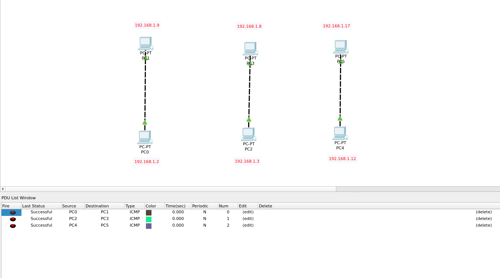
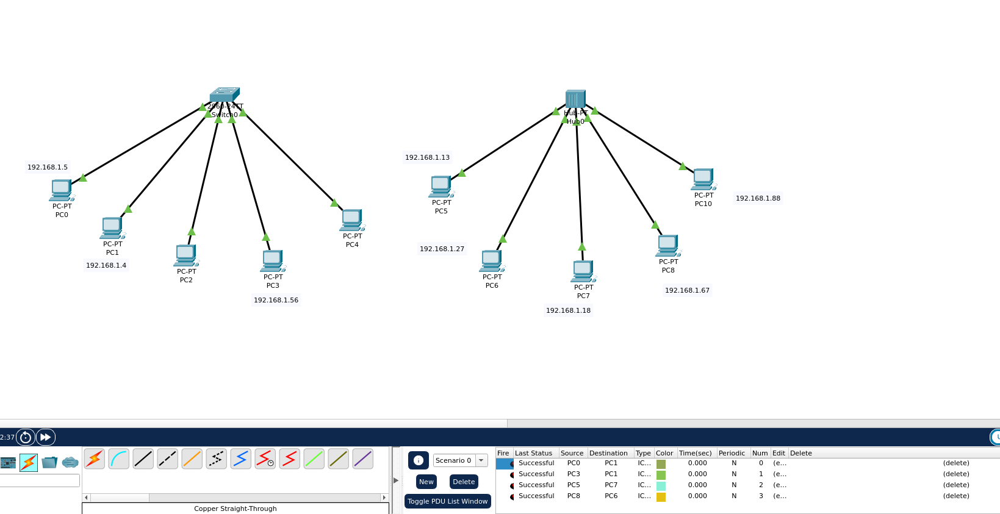
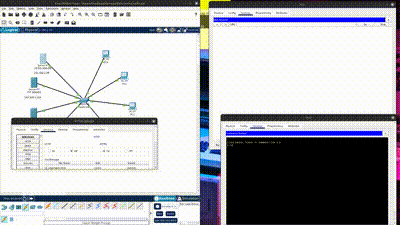
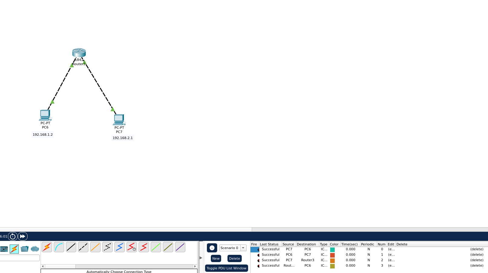
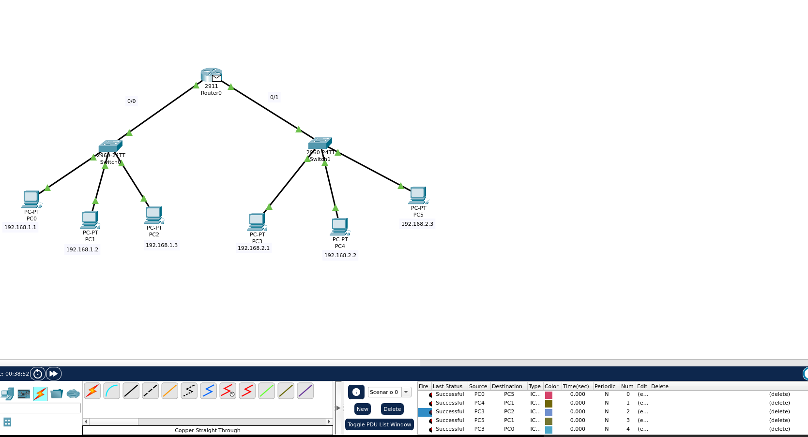
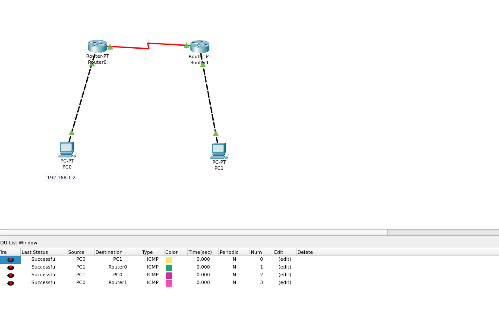
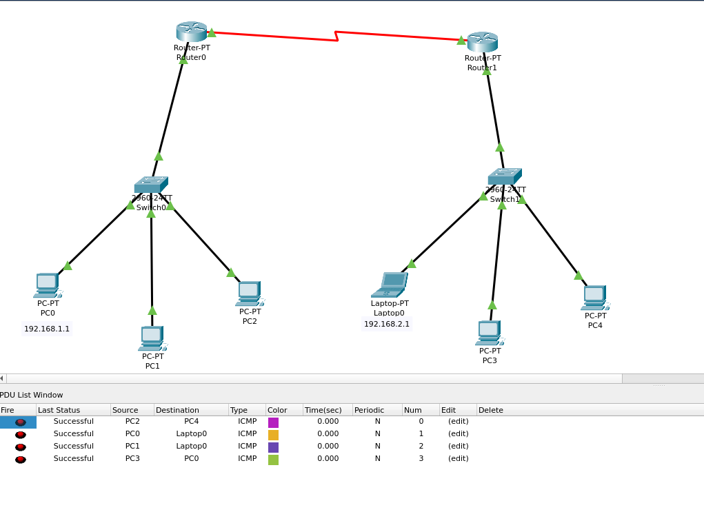
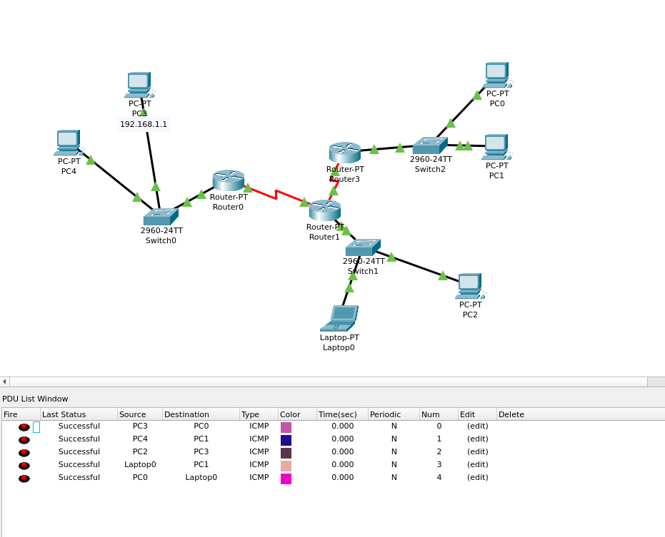

# Deep-in-Net

---

## Indroduction

Welcome to the networking exercises guide! This document provides answers and explanations for a series of hands-on exercises covering essential networking concepts, such as cables, switches, routers, and communication protocols.

You will need to download Cisco Packet Tracer [https://www.netacad.com/cisco-packet-tracer] to complete some exercises. This tool allows you to simulate and configure networks in a virtual environment, offering valuable practice for real-world networking tasks.

**Each exercise builds on the previous one, helping you gain a solid understanding of networking principles. Let's get started!**

---

## Exercise 1

### What is an RJ-45 Cable?

An **RJ-45 cable** is a type of network cable commonly used for Ethernet connections. It has a **rectangular connector** with **8 pins** and is typically used to connect devices like **computers**, **routers**, and **switches** for wired data transmission in **local area networks (LANs)**. It is the standard cable used in most wired networking setups.

### Understand what is the difference between straight-through and crossover RJ-45 cables.

1. **Straight-through Cable**

   **Wires**: The wires are arranged **the same** on both ends.  
   **Use**: It is used to connect **different devices**, like a computer to a router or a switch to a router.

2. **Crossover Cable**  
   (Also used for our example image-1.png)
   - **Wires**: The wires are arranged **differently** on each end (two pairs are swapped).
   - **Use**: It is used to connect **similar devices**, like two computers or two switches directly to each other.

### In summary

    - **Straight-through = different devices (e.g., computer to router)**
    - **Crossover = similar devices (e.g., computer to computer)**

## Exercise 2

## Understand the function of a switch and a hub, how they operate and their role in networking.

### Switch:

#### **Function:**

A **switch** connects multiple devices in a network and sends data only to the **device it is meant for**.

#### **How it Works:**

- **MAC addresses** are used to identify devices in the network.
- When the switch receives data, it checks the **destination MAC address** and forwards the data only to the correct device.

#### **OSI Model Layer:**

- Operates at **Layer 2 (Data Link Layer)**, which is more intelligent and focused on reducing network traffic.

### Hub

#### **Function:**

A **hub** also connects multiple devices, but it sends data to **all devices** in the network, not just the intended one.

#### **How it Works:**

- A hub **does not check** the destination of the data.
- It simply **broadcasts** the data to **everyone** on the network, leading to potential congestion.

#### **Role:**

- **Less efficient** than a switch.
- Can cause **network slowdowns** due to unnecessary data being sent to all devices.

#### **OSI Model Layer:**

- Operates at **Layer 1 (Physical Layer)**, which is simple and focused on broadcasting data without checking for the destination.

### Summary

| **Device** | **Function**                      | **Efficiency**    | **OSI Layer**           |
| ---------- | --------------------------------- | ----------------- | ----------------------- |
| **Switch** | Sends data to the correct device. | Reduces traffic   | **Layer 2 (Data Link)** |
| **Hub**    | Sends data to all devices.        | Increases traffic | **Layer 1 (Physical)**  |

### Key Differences:

- **Switch**: More intelligent, reduces traffic, and operates at **Layer 2 (Data Link Layer)**.
- **Hub**: Simpler, sends data to all devices, and operates at **Layer 1 (Physical Layer)**.

## Exercise 3

## 1. **Server and Its Purpose in Networking**

A **server** is a computer or system that provides services, data, or resources to other computers (clients) over a network. Examples of server services include:

- **Web pages**
- **Files**
- **Emails**
- **Games**

Servers allow clients to access these resources remotely over a network.

## 2. **DHCP (Dynamic Host Configuration Protocol)**

**DHCP** is a protocol that automatically assigns **IP addresses** to devices on a network. Instead of manually configuring each device, the **DHCP server** provides an IP address when a device joins the network.

- **Purpose**: Simplifies network management by automatically assigning IPs.

## 3. **DNS (Domain Name System)**

**DNS** is like the **phonebook of the internet**. It translates **domain names** (e.g., `www.example.com`) into **IP addresses** (e.g., `192.168.1.1`) so computers can locate each other over a network.

- **Purpose**: Allows humans to use easy-to-remember domain names instead of numerical IP addresses.

## 4. **HTTP (Hypertext Transfer Protocol)**

**HTTP** is used for transferring **web pages** over the internet. When you visit a website, your browser uses HTTP to **request and receive web pages** from a web server.

- **Purpose**: Facilitates communication between a client and a web server for loading web pages.

## 5. **HTTPS (Hypertext Transfer Protocol Secure)**

**HTTPS** is a **secure version of HTTP**. It uses **encryption** to protect data during transmission, ensuring privacy and security, especially for online transactions.

- **Purpose**: Ensures a secure connection between the browser and server by encrypting data.

## 6. **FTP (File Transfer Protocol)**

**FTP** is a protocol used to **transfer files** over a network. It allows users to **upload** or **download files** to/from a server and is often used for:

- **Website maintenance**
- **File sharing**

## 7. **TCP and UDP Communication**

### **TCP (Transmission Control Protocol)**

- **Reliable**: Ensures data is delivered in order, without errors.
- **Usage**: Ideal for applications requiring reliability, such as **web browsing** and **email**.

### **UDP (User Datagram Protocol)**

- **Faster but less reliable**: Doesn't guarantee delivery or order.
- **Usage**: Suitable for applications like **video streaming** or **gaming**, where speed is more important than reliability.

## 8. **OSI Model Layer for TCP and UDP**

Both **TCP** and **UDP** operate at the **Transport Layer (Layer 4)** of the OSI model. This layer is responsible for:

- **End-to-end communication**
- **Data flow control** between devices

## 9. **Port in Networking**

A **port** is like a **door** on a computer that allows different types of data to flow into or out of a device. Each protocol typically uses a specific port number to identify its communication channel.

## 10. **Ports and OSI Layers for Protocols**

| **Protocol** | **Port Number** | **OSI Layer**                   |
| ------------ | --------------- | ------------------------------- |
| **HTTP**     | 80              | **Application Layer (Layer 7)** |
| **HTTPS**    | 443             | **Application Layer (Layer 7)** |
| **FTP**      | 21              | **Application Layer (Layer 7)** |
| **TCP/UDP**  | Various         | **Transport Layer (Layer 4)**   |

## 11. **Different Types of DNS Records**

### **A Record (Address Record)**

Maps a **domain name** to an **IP address**.

### **MX Record (Mail Exchange Record)**

Specifies **mail servers** for a domain, directing email traffic.

### **CNAME Record (Canonical Name Record)**

Maps a **domain** to another **domain** (alias).

### **NS Record (Name Server Record)**

Defines **authoritative name servers** for a domain, helping resolve DNS queries.

### **PTR Record (Pointer Record)**

Used for **reverse DNS lookups**, mapping an **IP address** to a **domain name**.

## Summary of Key Concepts

- **Server**: Provides services (e.g., web pages, files) to clients.
- **DHCP**: Automatically assigns IP addresses to devices on a network.
- **DNS**: Translates domain names into IP addresses.
- **HTTP**: Used for transferring web pages.
- **HTTPS**: Secure version of HTTP, encrypting data for secure communication.
- **FTP**: Used for transferring files over a network.
- **TCP and UDP**: Communication protocols at **Layer 4** of the OSI model, with **TCP** being reliable and **UDP** being faster but less reliable.
- **Ports**: Used to manage data flow to different services on a device, with specific protocols using defined port numbers.
- **DNS Records**: Provide information about domain names, including mapping IPs, mail servers, and aliases.

# Exercise 4

## 1. **What is a Router and What is Its Role?**

A **router** is a device that connects different networks together. It decides the best path for data to travel between those networks. Routers are used to connect your **home network** to the **internet**, allowing devices to communicate with servers and websites.

- **Function**: Directs data between different networks.
- **Example**: A router connects your **home network** to the **internet**, allowing you to browse websites, send emails, or stream videos.

## 2. **Difference Between a Switch and a Router**

### **Switch**:

- **Role**: Connects devices within the same network (e.g., computers, printers, servers).
- **How it Works**: Uses **MAC addresses** to direct communication between devices.
- **OSI Model Layer**: Operates at **Layer 2 (Data Link Layer)**.

### **Router**:

- **Role**: Connects different networks together (e.g., home network to the internet).
- **How it Works**: Uses **IP addresses** to determine the best path for sending data between networks.
- **OSI Model Layer**: Operates at **Layer 3 (Network Layer)**.

#### **Key Difference**:

- A **switch** handles traffic within a **local network**.
- A **router** handles traffic between **different networks**.

## 3. **Identify the OSI Model Layer Where a Router Operates**

A **router** operates at **Layer 3** of the OSI model, also known as the **Network Layer**. At this layer, the router uses **IP addresses** to make decisions about the best path for data to travel between networks.

- **OSI Model Layer for Router**: **Layer 3 (Network Layer)**.

## 4. **What is a Default Gateway?**

A **default gateway** is like the **"door"** out of your network. It is the **router’s IP address** that devices use to send data to other networks, such as the internet.

### **How It Works**:

- When a device (like a computer or phone) wants to access something outside of its local network (for example, a website), it sends the request to the **default gateway**.
- The **router** (default gateway) forwards this request to the internet, allowing the device to access websites and other online resources.

### **Example**:

- When your phone wants to open a website, it sends a request to the **default gateway** (your router). The router then forwards the request to the internet, where it fetches the website and sends the data back to your device.

## Summary of Key Concepts

| **Concept**              | **Definition**                                                                 |
| ------------------------ | ------------------------------------------------------------------------------ |
| **Router**               | Connects different networks and determines the best path for data.             |
| **Switch**               | Connects devices within the same network, using MAC addresses.                 |
| **OSI Layer for Router** | **Layer 3 (Network Layer)**, handles routing based on IP addresses.            |
| **Default Gateway**      | The router’s IP address that devices use to communicate outside their network. |

---

## Exercise 5

## Exercise 6

## 1. **What is a Routing Table?**

A **routing table** is like a **map** that a router uses to decide where to send data. It contains a list of all the possible networks the router knows about and provides information on the best way to reach each network.

- **Purpose**: Directs network traffic by providing routing information to the router.
- **Contents**: The routing table includes:
  - **Destination networks**: The final destination where the data should go.
  - **Next hop**: The next router or device to forward the data to on its journey.
  - **Path cost**: The efficiency or cost of a route (often based on speed or network load).

---

## 2. **Role of the Routing Table in Routing Network Traffic**

When data arrives at the router, the router looks at its **routing table** to decide where to send the data next. The routing table helps guide the data to its correct destination.

- **Destination Networks**: The routing table lists where the data should go. For example, if data is destined for a different network, the router checks the table to find the best route.
- **Next Hop**: The table tells the router which router or device to forward the data to. It’s like the next step on the path to the final destination.
- **Path Cost**: The routing table may include information about the cost of each route. Some routes may be faster or more efficient than others, and the router will choose the best option based on the cost.

---

## 3. **In Simple Terms:**

Think of the **routing table** as a **GPS** for the router. Just like GPS helps you find the best route to your destination, the routing table helps the router find the best path for data to reach its destination.

- **Router's job**: When data arrives, the router checks its routing table to figure out the next step, ensuring data gets to the right place.

---

## Summary of Key Concepts

| **Concept**              | **Definition**                                                                         |
| ------------------------ | -------------------------------------------------------------------------------------- |
| **Routing Table**        | A list of networks and paths that the router uses to forward data efficiently.         |
| **Destination Networks** | The networks that data needs to reach.                                                 |
| **Next Hop**             | The next router or device that the data will be forwarded to.                          |
| **Path Cost**            | The most efficient route for the data to travel, based on speed or efficiency.         |
| **Role**                 | Guides data to the correct destination, like GPS guides a driver to their destination. |

---

## Exercise 7

## Exercise 8

